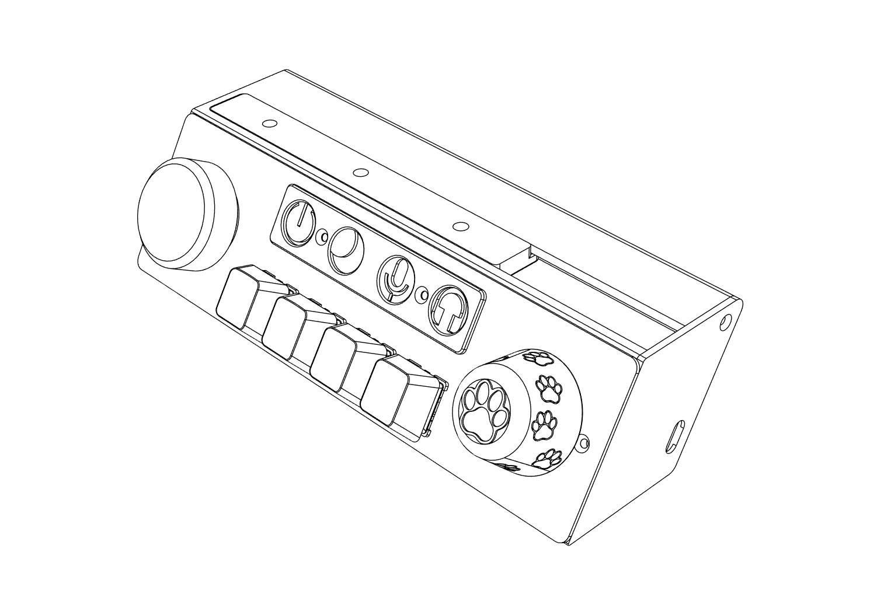
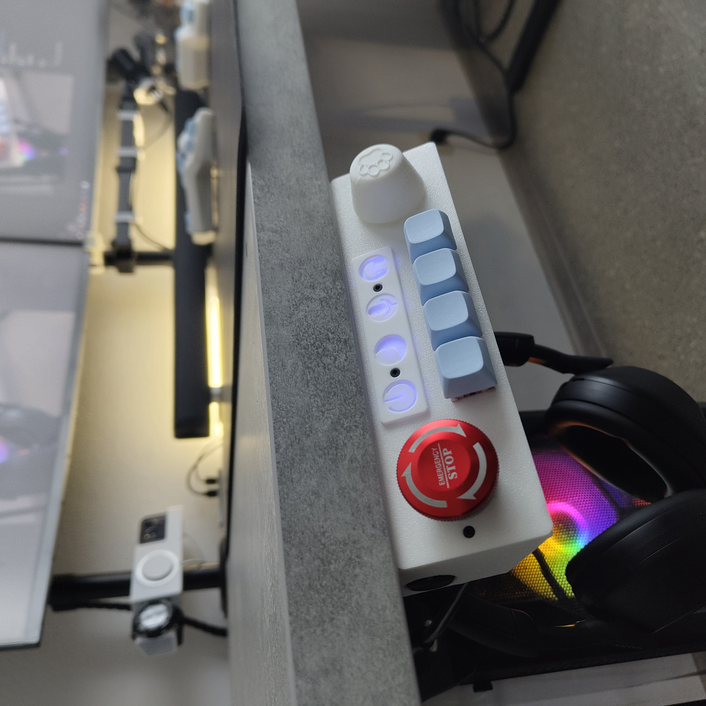
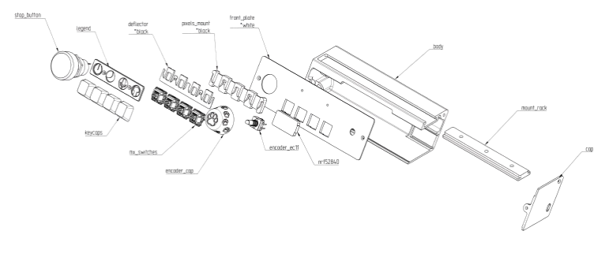
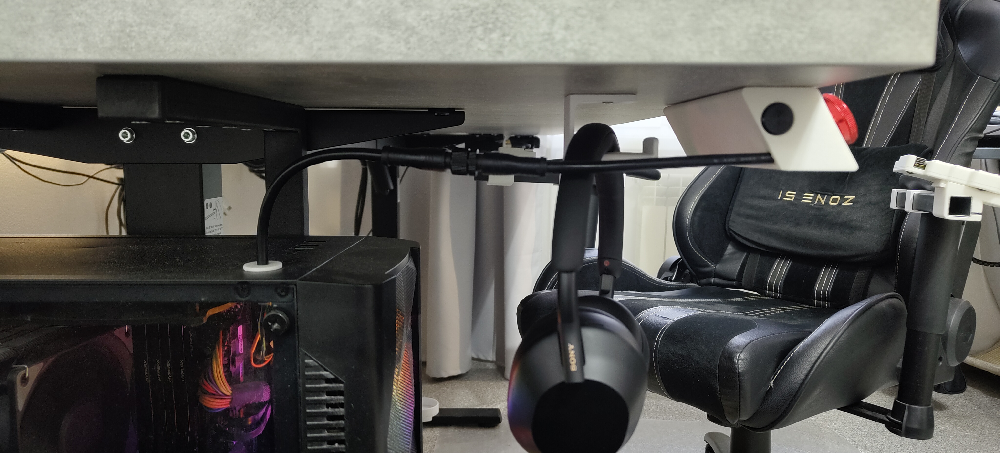
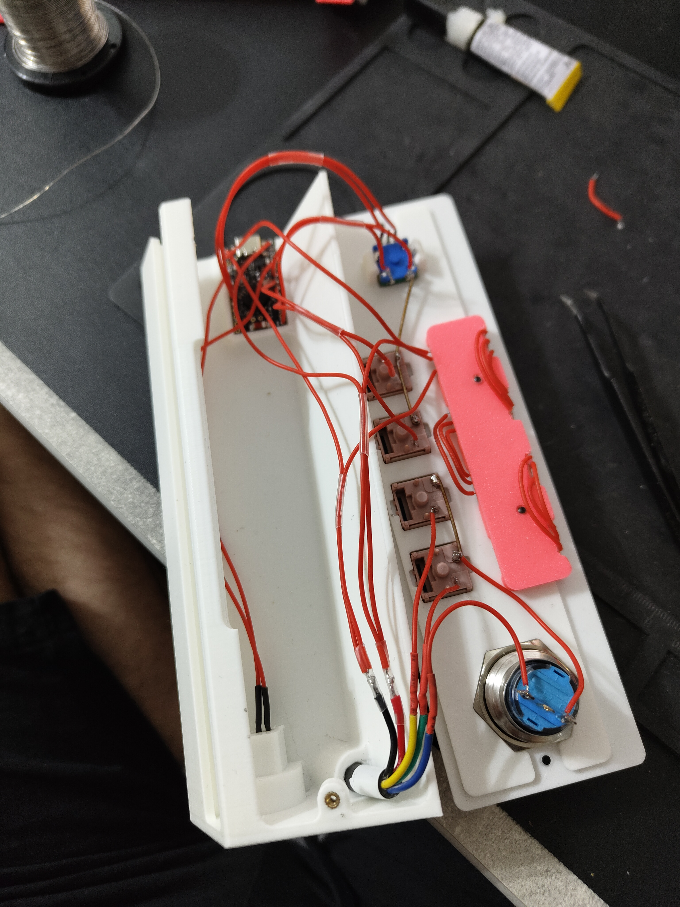
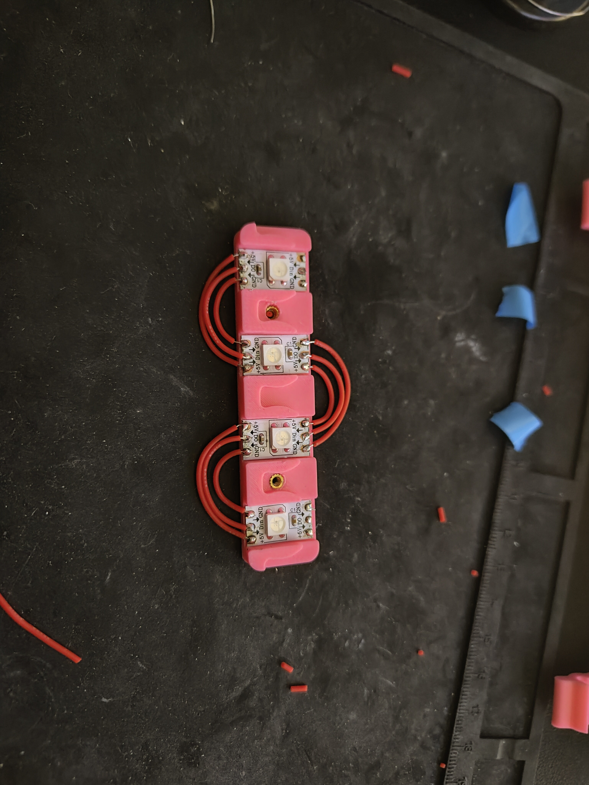

# nuke_pad 
Desktop macro pad for turning on/restarting the PC with blocking press using Emergency STOP Button. Fun project, looking good on the table. To make it even a little useful, it is equipped with EC11 encoders, for adjusting the volume of the system and applications. In addition, there are two programmable buttons controlled by the ZMK.



### Features
- 2 buttons connected directyly to PC motherboard and 2 programmable buttons (actually 3)
- Emergency stop button (satisfying to press and spin) to avoid accidental pressing of PC off button
- Programmable rotary encoder EC11 (with button)
- LED strip to hightlight buttons or current ZMK layer    

<br><br>

<br><br>


## Design Highlights



- **front_plate**
  - Print with *maximum infill*
  - Best printed *white*, as it is used as a diffuser
  - If you want a different color: Use the **deflector** version that works as a diffuser, and **front_plate** with *through holes*

- **legend**
  - Print with *maximum infill*
  - Removable — can be replaced with your actual bindings variant

- **mount_rack**
  - Length is parameterized (see the Fusion 360 file)
  - I like short version, can be slightly offset if someone sits next to you

- **deflector** and **pixels_mount**
  - Best printed in *black*, this ensures only the **legend** symbols shines
  - If parasitic light rays inside **body** are acceptable, the **deflector** can be omitted

- **encoder_cap**
  - There is my 2 versions available: *simple* and *cat* (designed for 20 mm EC11)
  - Many alternatives are available on MakerWorld, Thingiverse, etc., or you can buy one
<br><br>

### BOM


| Name                                                                                                                                                                                                 | Quantity | Price | Comment                                                                                                                              |
| ---------------------------------------------------------------------------------------------------------------------------------------------------------------------------------------------------- | -------- | ----------- | ------------------------------------------------------------------------------------------------------------------------------------ |
| [NRF52840 board](https://aliexpress.ru/item/1005009516681283.html?sku_id=12000049341617471&spm=a2g2w.productlist.search_results.0.32ea4dbeAhuni3)                                                    | 1        | $1.55        | or similar supported by zmk analogali                                                                                             |
| [Emergency STOP Push Button](https://aliexpress.ru/item/1005002613977827.html?sku_id=12000021401318038&spm=a2g2w.productlist.search_results.14.4b686efab8oemC)                                       | 1        | $3.88        | or similar, then it will be necessary to change the mounting place                                                                   |
| [Switches Outemu Silent Peach V2](https://aliexpress.ru/item/1005006363535460.html?sku_id=12000036901918043&spm=a2g2w.productlist.search_results.11.15c64f2dn3sZhQ)                                  | 4        | $1.14        | good outemu switches (maybe the one that is good), any MX will work                                                                  |
| [XDA Profile Keycaps](https://aliexpress.ru/item/1005004389755716.html?spm=a2g2w.orderdetail.0.0.689b4aa6Efb6wZ&sku_id=12000030860342463&_ga=2.157131771.1520881471.1765715163-988742981.1763378754) | 4        | $2.16        | expensive, but good quality, any MX will work                                                                                        |
| [WS2812B RGBW Led Strip 60](https://aliexpress.ru/item/1005009339270479.html?sku_id=12000048803269587&spm=a2g2w.productlist.search_results.3.4d4a2665wzzpOD)                                         | 4 pixels | -           | LED step is not important, the tape is cut and each pixel is attached separately                                                     |
| [Reset button](https://aliexpress.ru/item/1005009149131677.html?sku_id=12000048094409160&spm=a2g2w.productlist.search_results.1.641e709anyLKcK)                                                      | 1        | $0.17        | I use a button from the PC case (check link) to not lose it, if your case use other option you can buy by link and print button part |
| [5pin socket F+M](https://aliexpress.ru/item/32837212844.html?sku_id=65102449054&spm=a2g2w.productlist.search_results.1.509552b5VlDOdD)                                                              | 1        | $1.47        | I use unique sockets from my work, but think GX12 variant works fine there + 5x0.5 cable works fine there                            |
| [Rotary Encoder EC11](https://aliexpress.ru/item/1005006693443387.html?sku_id=12000048311239356&spm=a2g2w.productlist.search_results.2.16186932cDnAvk)                                               | 1        | $0.68        | or similar, then it will be necessary to change the mounting and update zmk spi settings
| [Heat Brass Insert Nut M2 and DIN7991 Screws](https://aliexpress.ru/item/1005006798286851.html?sku_id=12000038340344499&spm=a2g2w.productlist.search_results.1.762852bbJJbRJt)                                          | 4        | -           | or analog
| [3D printed parts](https://github.com/Fliegende-Rehe/nuke_pad/blob/main/3d)                                                                                                                          | 8-9        | -           | 3mf for bambustudio and step model if you want to edit anything       

<br><br>

## Wiring and assembly

```    
&pinctrl {
    spi3_default: spi3_default {
        group1 {
            psels = <NRF_PSEL(SPIM_MOSI, 0, 6)>; // led pin
        };
    };
};
default_kscan: kscan_0 {
    row-gpios = <&gpio0 9 (GPIO_ACTIVE_HIGH | GPIO_PULL_DOWN)>;

    col-gpios
        = <&gpio1 13 GPIO_ACTIVE_HIGH>
        , <&gpio1 15 GPIO_ACTIVE_HIGH>
        , <&gpio0 02 GPIO_ACTIVE_HIGH>
        , <&gpio0 29 GPIO_ACTIVE_HIGH>
        , <&gpio0 31 GPIO_ACTIVE_HIGH> // encoder button
        ;
};

default_encoder: encoder_0 {
    compatible = "alps,ec11";
    a-gpios = <&gpio1 11 (GPIO_ACTIVE_HIGH | GPIO_PULL_UP)>;
    b-gpios = <&gpio0 10 (GPIO_ACTIVE_HIGH | GPIO_PULL_UP)>;
    status = "okay";
};
```

1) Remove PC power button, and connect PWR and RESET SW to female part of socket
2) Place switches, encoder, and stop button on **front_plate**
3) Place male part of socket and **NRF52840** board into **body** (If you want, you can put a short strip of two-sided tape under the controller, but the friction also holds, depends on print quality)
4) Solder everything based on the scheme and photos below, you can change the soldering scheme, but you will need to make changes in zmk overlay files
5) Screw rack to table with 2 self-tapping screws M3 and slide body into rack 
6) Screw cap to body (1 screws on side and 1 front), connect nuke_pad to PC socket


<br><br>
<p align="center">
  
  
  
</p>

    !! dont be me, add diodes to row otherwise the combos won’t work !!

### Software
I create nuke_box board in my [zmk-config repository](https://github.com/Fliegende-Rehe/zmk-config). Follow the the [zmk-config installation guide](https://zmk.dev/docs/user-setup) for installation. From what should be mentioned I added dummy buttons in overlay and physical layot, to draw keymap with [keymap-drawer](https://github.com/caksoylar/keymap-drawer), so in the current build, these bindings meaningless.


## TODO:
0) add diodes to row for combos 
1) connect stop button and 2 PC buttons to controller for led animations
2) update model for available to buy components 
3) think of more appropriate name 
4) integrate the remote of the electric drive of the table
5) pcb is overkill for fun project, but implementation is pretty easy